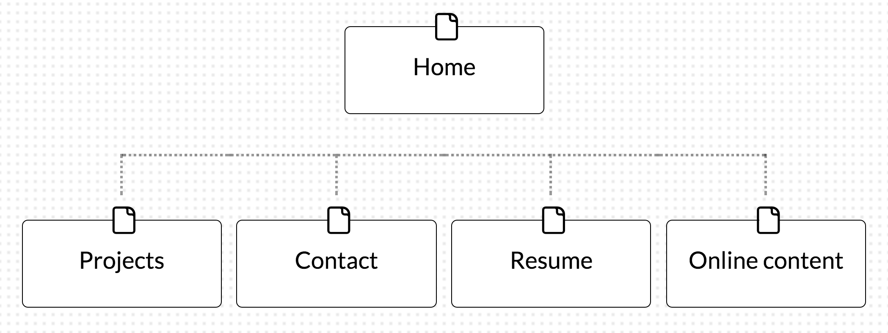

What are the 6 Phases of Web Design?

Information Gathering
Planning
Design
Development
Testing and Delivery
Maintenance

What is your site's primary goal or purpose? What kind of content will your site feature?

Show off my skills and my history of progression.

What is your target audience's interests and how do you see your site addressing them?

To show off my resume and projects for job hunting. By hosting links to my projects and being a centeral profolio

What is the primary "action" the user should take when coming to your site? Do you want them to search for information, contact you, or see your portfolio? It's ok to have several actions at once, or different actions for different kinds of visitors.

Portfolio and contact me.

What are the main things someone should know about design and user experience?

Simple design. KISS design.

What is user experience design and why is it valuable?

UX is the study of how users want to use the product and making it that way. This also includes designing for what they want not what they ask. People will ask for one thing but really me something else.

Which parts of the challenge did you find tedious?

I miss read something and had to go back and redo it. Other then that it worked fine this time.
