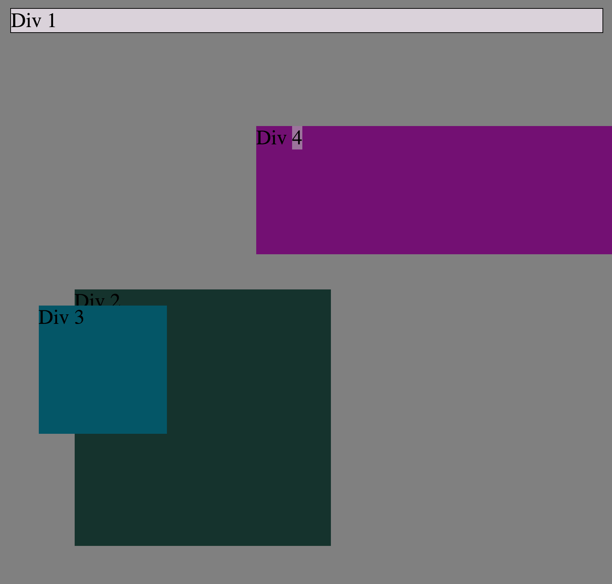

Question: How can you use Chrome's DevTools inspector to help you format or position elements?
Answer: You can use Chrome's Devtools to switch the properties around live on the page. It is very helpful.

Question: How can you resize elements on the DOM using CSS?
Answer: Using height and width.

Question: What are the differences between absolute, fixed, static, and relative positioning? Which did you find easiest to use? Which was most difficult?
Answer: Static is default and is considered not positioned. Relative uses distance from top left right or bottom to move around. Fixed will Stay in it's relative position on the screen even if the page is scrolled.Absolute is like fixed but it will use the nearest positioned ancestor.

Fixed was super easy to use. I still having a problem with absolute.

Question: What are the differences between margin, border, and padding?
The order they are in from the content container.

                            Margin
                            -------
                            Border
                            -------
                            Padding
                            -------
Margin | Border | Padding | Content |Padding | Border | Margin
                            -------
                            Padding
                            -------
                            Border
                            -------
                            Margin
                            -------

Question: What was your impression of this challenge overall? (love, hate, and why?)

Answer: It was a good one to get used to the tools. Chrome's devtools are powerful and a good way to test things. Also something good for any dev to know about so you can code to protect your site from injection attacks.

*Images*

